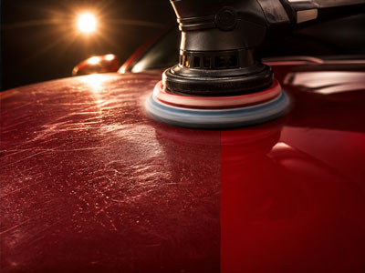

Paint protection comes in three tiers, and the right one depends less on the product than on how long you plan to keep the car and where it sleeps at night.

## Carnauba wax

The classic. Deep, warm gloss and the lowest cost — but it lasts six to eight weeks in Virginia's climate. Fine if you enjoy the ritual or the car is a short-term keep.

## Synthetic sealant

The workhorse we apply in most full details. Four to six months of protection, better chemical resistance than wax, and it stands up to summer UV and winter brine far better. For most daily drivers this is the sweet spot.

## Ceramic coating

A cured chemical layer that bonds to the clear coat and lasts years, not months. Water and grime release with a rinse, and UV protection is constant. The trade-offs are cost and prep: the paint must be corrected first, because a coating locks in whatever is under it — swirls included.

> A ceramic coating is not a force field. It resists chemicals and UV; it does not stop rock chips or bad washing habits.

## Our honest recommendation

If you keep cars three years or less, sealant with each seasonal detail is the best value. If you plan to keep the car long-term and park outdoors, the math on a coating starts to work. Either way, protection applied to clean, corrected paint outperforms a better product applied over contamination.
